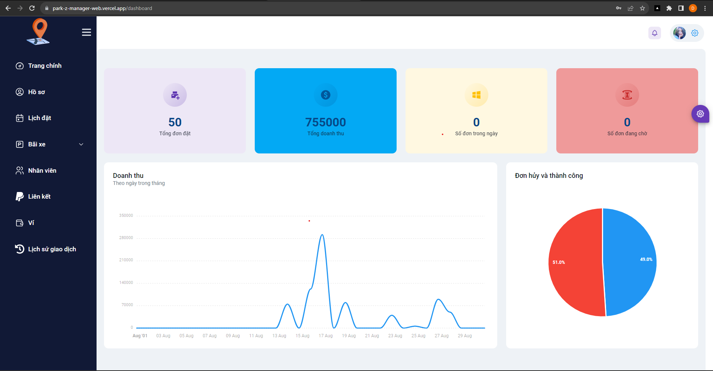
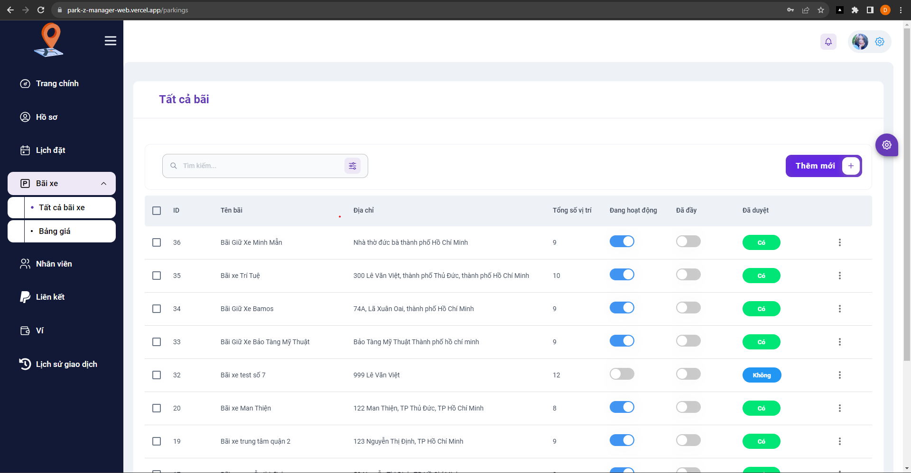
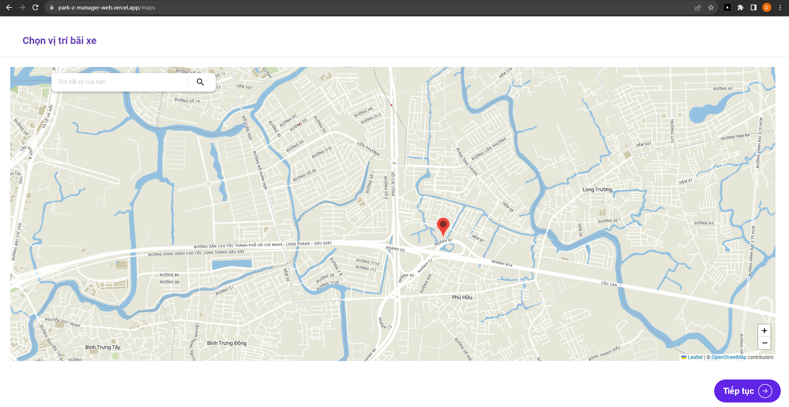
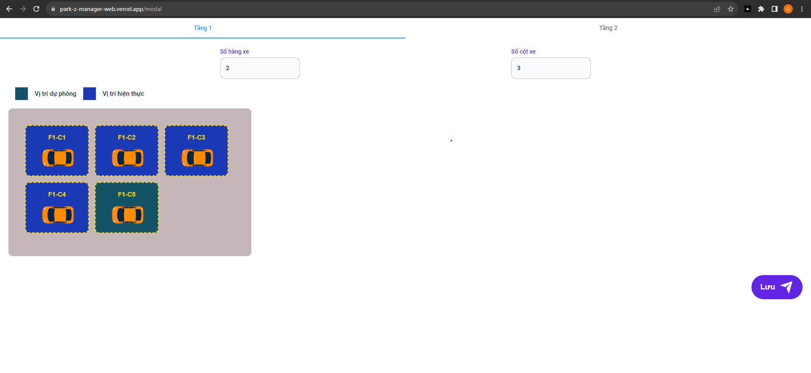
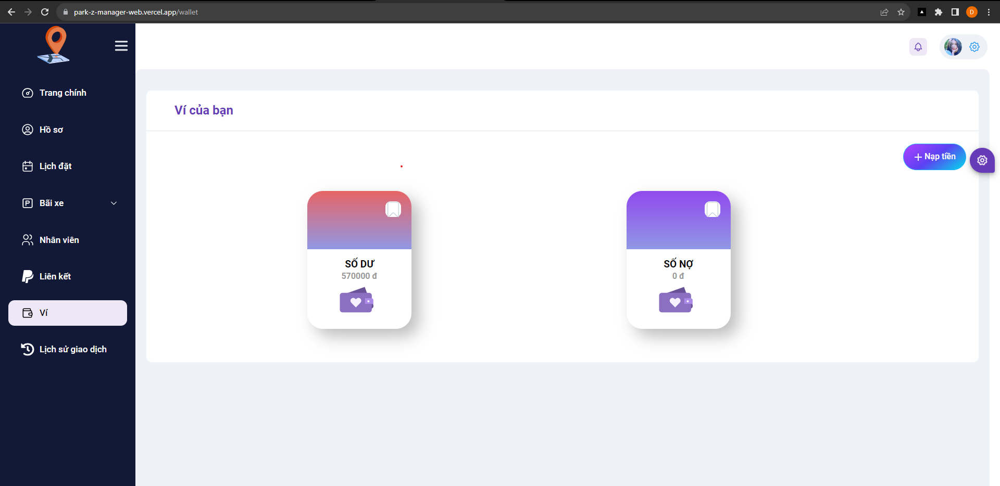

# Getting Started with Create React App

This project was bootstrapped with [Create React App](https://github.com/facebook/create-react-app).

## Available Scripts

In the project directory, you can run:

### `npm start/yarn start`

Runs the app in the development mode.\
Open [http://localhost:3000](http://localhost:3000) to view it in your browser.

The page will reload when you make changes.\
You may also see any lint errors in the console.

### `npm test`

Launches the test runner in the interactive watch mode.\
See the section about [running tests](https://facebook.github.io/create-react-app/docs/running-tests) for more information.

### `npm run build`

Builds the app for production to the `build` folder.\
It correctly bundles React in production mode and optimizes the build for the best performance.

The build is minified and the filenames include the hashes.\
Your app is ready to be deployed!

See the section about [deployment](https://facebook.github.io/create-react-app/docs/deployment) for more information.

### `npm run eject`

**Note: this is a one-way operation. Once you `eject`, you can't go back!**

If you aren't satisfied with the build tool and configuration choices, you can `eject` at any time. This command will remove the single build dependency from your project.

Instead, it will copy all the configuration files and the transitive dependencies (webpack, Babel, ESLint, etc) right into your project so you have full control over them. All of the commands except `eject` will still work, but they will point to the copied scripts so you can tweak them. At this point you're on your own.

You don't have to ever use `eject`. The curated feature set is suitable for small and middle deployments, and you shouldn't feel obligated to use this feature. However we understand that this tool wouldn't be useful if you couldn't customize it when you are ready for it.

## My ParkZ Web Application

My website is deployed on vercel server [https://vercel.com](https://vercel.com)\
And this website has an limit is not responsive for many screen.

After login will navigate to dashboard, my dashboard like this:

My Website using many component and css from:

- Ant design [https://ant.design/](https://ant.design/)
- Material UI [https://mui.com/](https://mui.com/)
- Tailwind CSS [https://tailwindcss.com/](https://tailwindcss.com/)
- Button we get from [https://uiverse.io/buttons](https://uiverse.io/buttons)
- Alert we using Sweet Alert [https://sweetalert2.github.io/](https://sweetalert2.github.io/)

This Website using Redux/toolkit and combine with SignalR to realtime for changed data avoid to reload page\
And push notification to back ground PC with message is sent from Firebase Message Cloud [https://firebase.google.com/](https://firebase.google.com/)

This website will have many function and manage many tab like:

- Manage Profile of manager with tab "Hồ Sơ"
- Manage Booking from Customer in tab "Lịch Đặt"
- Manage list of Parking and Parking price

* With tab parking will manage list of Parking:

- When create new parking will update position on the maps, using react-leaflet and leaflet:

- And Will change physical modal of each floor relatively so that nearly the same with the position of slots that floor. Each slot wil be drag and drop but this can not make in perfect way to create a physical modal of parking, it will provide easy way to customer and manager can manage slot in a good way:

- Manage Wallet

